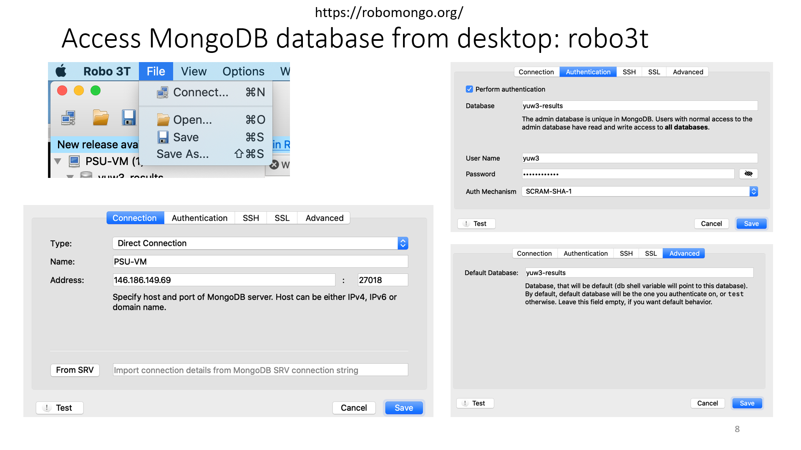

Installation
============

- Requirements

  DFTTK requires YPHON, MongodB, Python 3. Python 2 support for NumPy ends 2019-01-01. 
  Anaconda packages of DFTTK are currently not supported. If you are using Anaconda, 
  you should be able to install with ``pip``.

Virtual environment
-------------------

- Create virtual environment (optional)

Anaconda or Miniconda is required. (Another option is using virtualenv)

.. code-block:: bash

    #conda create -n ENV_NAME python=VERSION
    conda create -n dfttk python=3.6
    #Activate
    conda activate dfttk
    #Deactivate
    conda deactivate

- Release version

.. code-block:: bash

    pip install dfttk
    mkdir dfttk #if dfttk folder not exist. 
    cd dfttk
    dfttk config -mp -aci #a folder named "config" will be created where running environmental info saved

- Development version

.. code-block:: bash

    git clone https://github.com/PhasesResearchLab/dfttk.git
    cd dfttk
    pip install -e .
    cd dfttk
    dfttk config -mp -aci #a folder named "config" will be created where running environmental info saved

YPHON
-----

To postprocess the finite properties, the Yphon package is required. Yphon can be installed by run

.. code-block:: bash

    cd ~
    git clone https://github.com/yiwang62/YphonPackage
    #Note: Usually the precompiled binaries should be executable in the common Linux/Unix environment. If not, do the following:

.. code-block:: bash

    cd YphonPackage/YPHON/YPHON 
    make
    #Note: If errors reported in the compiling stage, insert one line #define R_OK 1 after #include

For csh user: the command search path should be changed by inserting line below into the .cshrc  (.tcshrc) file

.. code-block:: bash

    set path = (. ~/YphonPackage/YPHON/YPHON $BIN_PATH $path)

For bsh user: the command search path should be changed by inserting the lines below into the .bash_profile (.bashrc) file

.. code-block:: bash

    PATH=.:~/YphonPackage/YPHON/YPHON:$BIN_PATH:$PATH
    export PATH

Config MongoDB
--------------

DFTTK needs MongoDB to manage DFT inputs/outputs settings including structure, force constants etc. The users of DFTTK can either buy the commercial MongoDB database management or set up their own MongoDB server. 

  Ask the MongoDB system manager for a json file named ``db.json`` to get your DFTTK results
  saved in MongoDB database.  The ``db.json`` file contains something similiar to the 
  following lines which should saved under the "dfttk/config" folder 
  that was created by "dfttk config -mp -aci" command mentioned above. 

.. _JSONLint: https://jsonlint.com

.. code-block:: JSON

    {
        "database": "userid-results",
        "collection": "tasks",
        "admin_user": "userid",
        "admin_password": "BeFihJ2mrKGm",
        "readonly_user": "userid-ro",
        "readonly_password": "QIvaUT9ca6H8",
        "host": "146.186.149.69",
        "port": 27018,
        "aliases": {}
    }

Access MongoDB database from desktop
------------------------------------

  One can download robo3T from https://robomongo.org/. After install it one use the information
  from the ``db.json`` file to setup robo3T connection as indicated in the following figure

  #note

  1. ``PSU-VM`` is an arbitray name for the connection that you want to use;

  2. ``146.186.149.69`` is the ip address of one's MongoDB server;

  3. One need to replace ``userid`` by one's own usedid provided by one's MongoDB system manage

