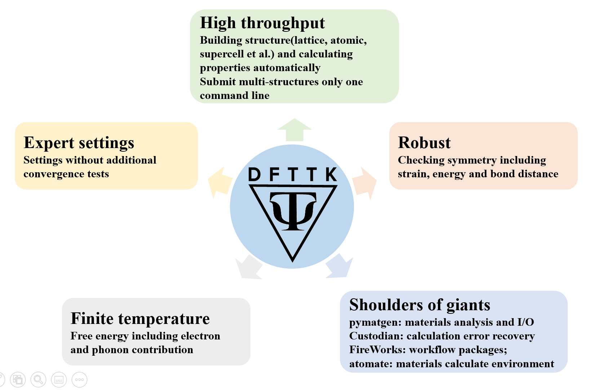
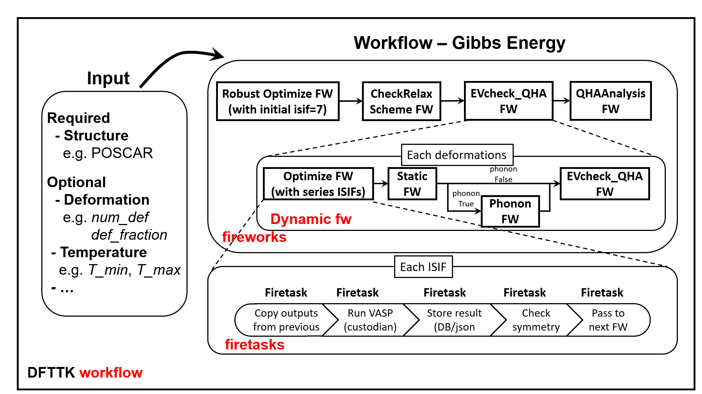
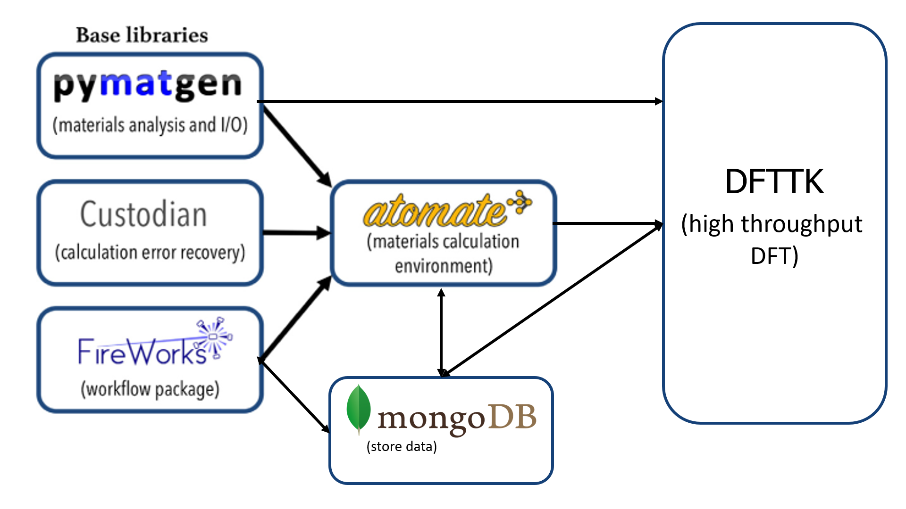
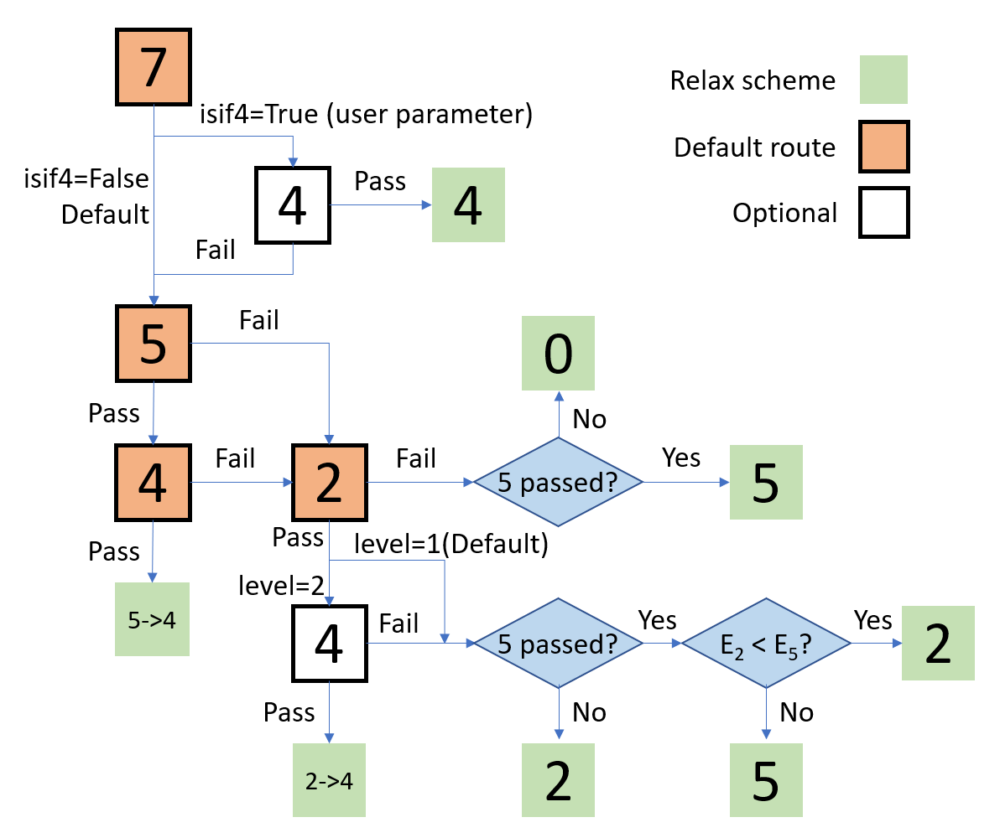

=========================================
DFTTK: Density Functional Theory Tool Kit
=========================================

The goal and solution
---------------------

For a given structure and elements, calculate all kinds of thermodynamic properties at finite temperature and pressure by first-principles approach based on density functional theory, including lattice vibration, thermal electron excitation, Seebeck coefficient, Lorenz number, effective charge carrier concentration etc. 

The goal of DFTTK is to make high-throughput first-principles calculations as simple as possible. 
The density functional theory (DFT) based software VASP is employed to perform first-principles calculations. In addition thermodynamic properties via the quasiharmonic approach, we proposed that any property, as long as it is dependent on the volume or stain, can be predicted using a quasi-static approach implemented by our group according to (i) the predicted property-volume/strain relationship from first-principles calculations directly and (ii) the volume/strain-temperature relationship of materials from the quasiharmonic approach. 

Workflow of DFTTK
-----------------

High-throughput calculations
----------------------------

By its definition, the term of “first-principles” represents a philosophy that the prediction is to be based on a basic, fundamental proposition or assumption that cannot be deduced from any other proposition or assumption.  This implies that the computational formulations are based on the most fundamental theory of quantum mechanics - Schrödinger equation or density functional theory (DFT) and the inputs to the calculations must be based on well-defined physical constants – the nuclear and electronic charges.  In another word, once the atomic species of an assigned material are known, the theory should predict the energy of all possible crystalline structures, without invoking any phenomenological fitting parameters.  

However, to perform DFT calculations in reality, it still needs the user to have extensive experiences on a variety of parameter choices and a lot of human handling on numerical or system exceptions. In the last decade, we have been working on solving the problem by integrating our experiences accumulated on high-throughout DFT calculations into a software package named as DFTTK (DFT based toolkits) and opened to the community (https://www.dfttk.org). 

The main functions of DFTTK
---------------------------

•       Structure maker by protype and elemental substitution;
•       Robust 0 K equilibrium volume optimization;
•       Robust 0 K energy-volume curve optimization;
•       Quasiharmonic phonon calculation; 
•       Born effective charge calculation;
•       Elastic constant calculations.
•       MongoDB database management
•       Thermodynamic calculations and figure plots

DFTTK features
--------------

To perform DFT calculation using DFTTK, the user only needs to name the structure file called POSCAR by VASP, either prepared by user or produced by DFTTK  by elemental substation on given prototype. DFTTK is developed on atomate from the `Materials Project <https://materialsproject.org/>`_ which is built on three open-source Python libraries. The main benefits of atomate are its flexibility and data management platform, in particular the numerical convergence control and computational exception handling. DFTTK is able to predict properties at finite temperatures by phonon or Debye model for both stoichiometric and solution phases, featured by:

•       High-throughput DFT calculation and postprocess;
•       Postprocess plenty of data stored in MongoDB with one simple command;
•       Compatible with Yphon package and phonopy;
•       Can recover data from certain fizzled calculations;
•       Can account thermal electron contribution to thermodynamic properties;
•       Can calculate thermodynamic properties at 0 K and a few tenth K;
•       Can perform doping calculations for semiconductors or thermoelectric materials under rigid band approximation;
•       Can account the effect of thermal expansion/temperature on Seebeck coefficient, Lorenz number, thermal carrier concentrations;
•       Automatic plot figures for more than 20 thermodynamic properties in the publishable resolution, including atomic volume, free energy, entropy, enthalpy, linear thermal expansion coefficient, isobartic specific heat, constant volume specific heat, lattice only specific heat, bulk modulus, Debye temperature, Seebeck coefficient, Lorenz number, absolute thermal electric force, etc.

•       Robust relaxation scheme of DFTTK

